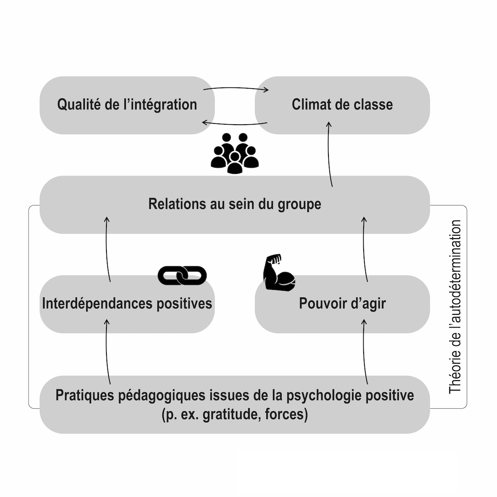

```{r setup, include=FALSE}
options(htmltools.dir.version = FALSE)
knitr::opts_chunk$set(
  fig.width=9, fig.height=3.5, fig.retina=3,
  out.width = "100%",
  cache = FALSE,
  echo = FALSE,
  message = FALSE, 
  warning = FALSE,
  fig.show = TRUE,
  hiline = TRUE
)
```

```{r xaringan-themer, include=FALSE, warning=FALSE}
library(xaringanthemer)
style_duo_accent(
  primary_color = "#D2202B",
  secondary_color = "#D2202B",
  inverse_header_color = "#FFFFFF",
  link_color = "#676C72",
    header_font_google = google_font("Josefin Sans")

)
```

class: hide_logo, title-slide, inverse, bottom
background-image: url(`r rmarkdown::metadata$url_unsplash`)
background-size: cover

# `r rmarkdown::metadata$title`

## `r rmarkdown::metadata$subtitle`

### `r rmarkdown::metadata$author` - `r rmarkdown::metadata$team`

### `r rmarkdown::metadata$date`

<p xmlns:cc="http://creativecommons.org/ns#" xmlns:dct="http://purl.org/dc/terms/"><a property="dct:title" rel="cc:attributionURL" href="https://bresnico.github.io/phd-8-avril-2022/#1">Les slides de présentation</a> par <a rel="cc:attributionURL dct:creator" property="cc:attributionName" href="https://nicolasbressoud.ch">Nicolas Bressoud</a> sont soumises à une licence <a href="http://creativecommons.org/licenses/by-nc/4.0/?ref=chooser-v1" target="_blank" rel="license noopener noreferrer" style="display:inline-block;">CC BY-NC 4.0</a></p>

---
class: left


```{r xaringan-logo, echo=FALSE}
xaringanExtra::use_logo(
  image_url = "img/hep.png",
  width = "50px"
)
```

### Titre
Approche pédagogique basée sur les **forces personnelles** des élèves et développement du **climat de classe** : perspectives en contexte d'**inclusion scolaire**

--

### Mots-clés
Forces de caractère (ressources, forces personnelles), Climat de classe, Inclusion scolaire

--
### Direction de thèse

**Directrice principale :** Pr. Dr. Andrea Samson

**Co-directrice :** Pr. Dr. Rebecca Shankland, université Lyon Lumière 2

**Co-directeur :** Pr. Dr. Philippe Gay, HEP Vaud


---
class: middle left

### Structure

1. Contexte

1. Zoom sur **les forces de caractère**

1. Question de recherche et hypothèses

1. Méthode

1. Résultats envisagés

1. Divers

1. Prochaines étapes

---
class: title-slide, inverse
background-image: url("https://images.unsplash.com/photo-1469474968028-56623f02e42e?ixlib=rb-1.2.1&ixid=MnwxMjA3fDB8MHxwaG90by1wYWdlfHx8fGVufDB8fHx8&auto=format&fit=crop&w=2948&q=80")
background-size: cover

# Contexte

---
class: left

# Contexte


### Terrain scolaire romand

- Enseignement en classes hétérogènes
- Développement des mesures renforcées de l'enseignement spécialisé

--

### Thème prometteur

- Forces de caractère [(Peterson & Seligman, 2004)](https://psycnet.apa.org/record/2004-13277-000)
- Utilisation des forces (identifier, utiliser, promouvoir) [(Linkins et al., 2015)](https://www.tandfonline.com/doi/abs/10.1080/17439760.2014.888581)

--

### Impact relevé / potentiel

- Bénéfices pour les relations dans la classe [(Quinlan et al., 2014)](https://www.tandfonline.com/doi/abs/10.1080/17439760.2014.920407)
- Impact sur les affects positifs, le bien-être, la satisfaction de vie [(Schutte & Malouff, 2018)](https://link.springer.com/article/10.1007/s10902-018-9990-2)
- **Impact potentiel en contexte inclusif sur la qualité de vie, le besoin d'affiliation, le comportement prosocial,...)**

---
class: middle, center

### Prise de recul sur le fonctionnement possible

```{r out.width = '45%', echo=FALSE}
# local

```

[(Bressoud & Gay, 2022)](https://szh-shop.faros.ch/cms/Artikel-Detail/67565?itemID=REV2022_03)

---

class: middle

.left[


## &#x1F64F; Merci !

]

--

.right[


Crédits Photo par ordre d'apparition :

[Med Badr Chemmaoui](hhttps://unsplash.com/photos/ZSPBhokqDMc)

[David Marcu](https://unsplash.com/photos/78A265wPiO4)

[Ben White](https://unsplash.com/photos/lVCHfXn3VME)

[Engin Akyurt](https://unsplash.com/photos/bPiuY2ZSlvU)

[Shahadat Rahman](https://unsplash.com/photos/BfrQnKBulYQ)

[Kelly Sikkema](https://unsplash.com/photos/4JxV3Gs42Ks)

[Mats Hagwall](https://unsplash.com/photos/uzl47XdoLww)

[Vidar Nordli-Mathisen](https://unsplash.com/photos/Kuu5mmxkwW4)

[Towfiqu barbhuiya](https://unsplash.com/photos/oZuBNC-6E2s)

]
